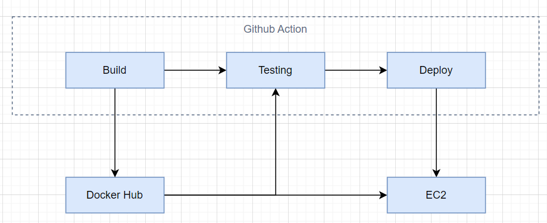

# Golden Owl DevOps Internship - Technical Test
At Golden Owl, we believe in treating infrastructure as code and automating resource provisioning to the fullest extent possible. 

In this technical test, we challenge you to create a robust CI build pipeline using GitHub Actions. You have the freedom to complete this test in your local environment.

## Your Mission 🌟
Your mission, should you choose to accept it, is to craft a CI job that:
1. Forks this repository to your personal GitHub account.
2. Dockerizes a Node.js application.
3. Establishes an automated CI/CD build process using GitHub Actions workflow and a container registry service such as DockerHub or Amazon Elastic Container Registry (ECR) or similar services.
4. Initiates CI tests automatically when changes are pushed to the feature branch on GitHub.
5. Utilizes GitHub Actions for Continuous Deployment (CD) to deploy the application to major cloud providers like AWS EC2, AWS ECS or Google Cloud (please submit the deployment link).



## 1. Forks this repository to your personal GitHub account
Link : [GitHub - bibichannel/goldenowl-devops-internship-challenge](https://github.com/bibichannel/goldenowl-devops-internship-challenge)

## 2. Dockerizes a Node.js application
In this section, we will create two files in the src directory, namely `Dockerfile.base` and `Dockerfile`. The purpose of creating `Dockerfile.base` is to generate a base image that will be used throughout the project. This base image will be pre-installed with necessary libraries and uploaded to the Docker Hub registry. When building an image from the updated source code in the project, it will be built based on our base image.
### Step 1: Create Dockerfile.base file
```Dockerfile
FROM node:lts-alpine3.18

WORKDIR /usr/src/app

COPY package*.json ./

RUN npm i
```

Here we use `node:lts-alpine3.18` as the environment for the base image. It includes the essential libraries needed to run a simple Node.js app, with a small footprint and good security.

### Step2: Create Dockerfile file
```Dockerfile
FROM bibichannel/godenowl:base

WORKDIR /usr/src/app

COPY package*.json ./

RUN npm i

COPY . .

EXPOSE 3000
  
CMD [ "npm", "start" ]
```

The Dockerfile utilizes the previously built base image to build a new Node.js image.

## 3. Establishes an automated CI/CD build process using GitHub Actions workflow and a container registry service DockerHub
### Step 1: Add secret variables for git action
We add the following variables
```
DOCKERHUB_USERNAME
DOCKERHUB_TOKEN
```

### Step 2: Config .yml workflow file

```yaml
name: Godenowl CICD

on:
  workflow_dispatch:
  push:
    branches:
      - "*"
    paths:
      - 'src/**'
      - '.github/workflows/cicd.yml'

jobs:
  build:
    runs-on: ubuntu-latest
    name: Build
    steps:
      - name: Checkout
        uses: actions/checkout@v3

      - name: Login to Docker Hub
        uses: docker/login-action@v3
        with:
          username: ${{ secrets.DOCKERHUB_USERNAME }}
          password: ${{ secrets.DOCKERHUB_TOKEN }}

      - name: Build image
        env:
          DOCKERHUB_USERNAME: ${{ secrets.DOCKERHUB_USERNAME }}
          IMAGE_TAG: ${{ github.sha }}
        run: |
          docker pull $DOCKERHUB_USERNAME/godenowl:base
          cd src && docker build -t $DOCKERHUB_USERNAME/godenowl:$IMAGE_TAG -f Dockerfile .

      - name: Push images to Docker Hub
        env:
          DOCKERHUB_USERNAME: ${{ secrets.DOCKERHUB_USERNAME }}
          IMAGE_TAG: ${{ github.sha }}
        run: |
          docker push $DOCKERHUB_USERNAME/godenowl:$IMAGE_TAG
          docker tag $DOCKERHUB_USERNAME/godenowl:$IMAGE_TAG $DOCKERHUB_USERNAME/godenowl:latest
          docker push $DOCKERHUB_USERNAME/godenowl:latest
```

Here, the workflow will be triggered when there is a code push event on any branch. It will build the code and push it to Docker Hub.

We perform two pushes to Docker Hub. One is with a tag that represents the SHA of the current commit being built, and the second one is with the "latest" tag. The latter is used for testing and deployment purposes.

## 4. Initiates CI tests automatically when changes are pushed to the feature branch on GitHub.
Thêm job sau vào file cicd.yml
```yaml
  testing:
    runs-on: ubuntu-latest
    name: testing
    needs: build
    steps:
      - name: Login to Docker Hub
        uses: docker/login-action@v3
        with:
          username: ${{ secrets.DOCKERHUB_USERNAME }}
          password: ${{ secrets.DOCKERHUB_TOKEN }}

      - name: Pull latest image
        env:
          DOCKERHUB_USERNAME: ${{ secrets.DOCKERHUB_USERNAME }}
        run: |
          docker pull $DOCKERHUB_USERNAME/godenowl:latest
        
      - name: Testing
        env:
          DOCKERHUB_USERNAME: ${{ secrets.DOCKERHUB_USERNAME }}
        run: |
          docker run $DOCKERHUB_USERNAME/godenowl:latest sh -c "npm test"
```

This job is executed after the build job is successful.
In the testing job, we pull the latest images with the `latest` tag to perform the tests.

## 5. Utilizes GitHub Actions for Continuous Deployment (CD) to deploy the application to major cloud providers AWS EC2
### Step 1: Setup ec2
We create an EC2 instance in a public subnet for the current test scenario and install the Docker engine on the EC2 instance.
Next, we will manually run a container named "backend" with the latest tag of the project.
### Step 2: Add secret variables
We will add some secret variables to enable SSH access to the EC2 instance.
### Step 3: Config .yml workflow file 
We add the following job to the cicd.yml file.
```yaml
  deploy:
    runs-on: ubuntu-latest
    name: deploy
    needs: [build, testing]
    if: github.ref == 'refs/heads/master'
    environment:  ${{ github.ref_name }}
    steps:
      - name: Checkout
        uses: actions/checkout@v3
      
      - name: executing remote ssh commands using ssh key
        uses: appleboy/ssh-action@v1.0.0
        env:
          DOCKERHUB_USERNAME: ${{ secrets.DOCKERHUB_USERNAME }}
        with:
          host: ${{ secrets.HOST }}
          username: ${{ secrets.USERNAME }}
          key: ${{ secrets.KEY }}
          port: ${{ secrets.PORT }}
          envs: DOCKERHUB_USERNAME
          script: |
            docker pull $DOCKERHUB_USERNAME/godenowl:latest
            docker stop backend
            docker rm backend
            docker run -d --name backend -p 80:3000 $DOCKERHUB_USERNAME/godenowl:latest
```
The "Deploy" job will only run when the two preceding jobs have completed successfully, and it will only run when there is a push event on the master branch.
It will SSH into the EC2 instance and proceed to stop the container of the current version. Then, it will deploy the latest version by starting a new container.

Link deploy: http://ec2-3-1-5-226.ap-southeast-1.compute.amazonaws.com
## Related
[Dockerizing a Node.js web app | Node.js](https://nodejs.org/en/docs/guides/nodejs-docker-webapp)